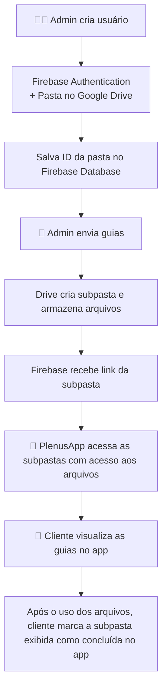

# PlenusDesk

**PlenusDesk** é uma aplicação web administrativa desenvolvida em **Flask**, utilizada por **empresas de contabilidade** para gerenciar clientes, guias de pagamento e documentos fiscais de forma centralizada.

Os clientes não acessam diretamente o painel Flask — eles interagem com os dados por meio do **[PlenusApp](#-conexão-com-o-plenusapp)**, um aplicativo Android desenvolvido em **Flutter**, que consome e exibe as informações sincronizadas automaticamente pelo PlenusDesk.

---
> ⚠️ **Aviso:**
>
> O repositório disponibiliza o código do PlenusDesk, mas a integração com **Firebase** e **Google Drive** foi removida por questões de segurança. Quem clonar o projeto não terá acesso a essa funcionalidade, que envolve sincronização de usuários e arquivos com o PlenusApp.
> O restante das funcionalidades do projeto, como validação de cupons fiscais e processamento de notas, está completo e pode ser testado normalmente.

---
## ☁️ Integração com Firebase e Google Drive

O sistema integra **Firebase** e **Google Drive** para sincronização automática de dados e arquivos entre o painel administrativo (PlenusDesk) e o aplicativo mobile (PlenusApp).

### 🔹 Criação de Usuário

1. O administrador cria um novo cliente no **PlenusDesk**;  
2. O sistema registra o usuário no **Firebase Authentication** com as credenciais informadas;  
3. É criada uma **pasta no Google Drive**, nomeada com o nome da empresa do cliente;  
4. A **ID dessa pasta** é salva no **Firebase Realtime Database**, dentro do nó `usuarios/<user_id>`;  
5. O **PlenusApp** utiliza essa ID para acessar e exibir os arquivos correspondentes ao cliente.

### 🎥 Demonstração — Cadastro de Cliente
(clique na imagem abaixo para acessar o vídeo)

### 🔹 Postagem de Guias

1. O administrador seleciona e envia os **documentos fiscais (PDF, XML, ZIP, etc)**;  
2. O sistema cria automaticamente uma **subpasta** dentro da pasta do cliente selecionado no Google Drive;  
3. Os arquivos são enviados para essa pasta e o **link** é armazenado no Firebase;  

#### 🎥 Demonstração — Postagem de Guia
(clique na imagem abaixo)

### 🔹 Acesso e Visualização de Guias

1. O cliente realiza o **login** utilizando o **Firebase Authentication**, com as credenciais cadastradas pelo administrador;  
2. Após a autenticação, o aplicativo obtém a **ID da pasta** associada ao cliente no Firebase;  
3. Com base nessa ID, o **PlenusApp** exibe todas as **guias** disponíveis, incluindo:
   - Título e descrição do documento;  
   - Data de postagem;  
   - Link direto para a **subpasta no Google Drive** onde os arquivos estão armazenados;  
4. O cliente pode clicar para abrir a pasta e visualizar os arquivos disponiveis.

#### 🎥 Demonstração — Acesso às Guias no App
(clique na imagem abaixo)

---

## ⚙️ Funcionalidades Complementares

Além da integração em nuvem, o PlenusDesk conta com automações que agilizam o controle fiscal e financeiro.

### 🧾 Validação de Cupons Fiscais
- Lê números de **cupons fiscais (NFC-e)** e valida o formato;  
- Detecta duplicidades e quebras de sequência;

### 📅 Processamento de Notas Fiscais
- Lê a **data de vencimento**, **parcelas** e **valor da nota** de cada **nota fiscal**;  
- Filtra as notas por **dia, mês, ano ou um período customizado**;
- **Soma automaticamente** os valores das notas do período selecionado, otimizando o cálculo contábil mensal.

Essas rotinas tornam o PlenusDesk uma ferramenta de **gestão inteligente de documentos fiscais**, indo além do simples envio de arquivos.

---

## 🔄 Fluxo de Dados

## 🧠 Arquitetura Técnica

A plataforma foi construída com um conjunto de tecnologias modernas e integradas, focando em escalabilidade e sincronização em tempo real.

| Camada | Tecnologia |
| :--- | :--- |
| **Frontend** | HTML, CSS e JavaScript |
| **Backend** | Flask (Python) |
| **Banco de Dados** | Firebase Realtime Database |
| **Autenticação** | Firebase Authentication |
| **Armazenamento de Arquivos** | Google Drive API |
| **Aplicativo Mobile** | Flutter (PlenusApp) |

## 🎥 Demonstrações

Os vídeos de demonstração a seguir mostram o sistema em uso real e destacam as funcionalidades principais:

* **👤 [Cadastro de usuários](https://youtu.be/L7051IGdOac)** e sincronização automática com o Firebase;
* **📂 [Cadastro e envio de guias](https://youtu.be/0ewJCWLgxqI)** e criação automática de pastas no Google Drive;
* **📱 [Acesso à guia e do usuário](https://youtu.be/4oot05qes-M)** direto do aplicativo PlenusApp;
* **🧾 [Visualização de todos os passos](https://youtu.be/OUaO2QWiLJU)**, do PlenusDesk (site) ao acesso do cliente ao PlenusApp (aplicativo).

## 📱 Conexão com o PlenusApp

O **PlenusApp** é o aplicativo Android desenvolvido em Flutter que permite aos clientes visualizar as guias, documentos e arquivos enviados via PlenusDesk.

Ambos os sistemas (PlenusDesk e PlenusApp) utilizam o **mesmo Firebase Realtime Database**, garantindo **sincronização imediata e segura** de todos os dados entre o painel administrativo e o aplicativo do cliente.

📦 Repositório do PlenusApp: (link em breve)

---

## 🚀 Aprendizados e Decisões Técnicas

Durante o desenvolvimento do **PlenusDesk** e do **PlenusApp**, enfrentei diversos desafios técnicos que resultaram em aprendizados valiosos e decisões estratégicas para equilibrar **custo, desempenho e segurança**.

### 💡 Principais Aprendizados

- **Primeiro contato com bancos NoSQL:** o projeto marcou minha primeira experiência prática com o **Firebase Realtime Database**, exigindo uma nova forma de estruturar e consultar dados.  
- **Primeira aplicação mobile real:** o **PlenusApp** foi meu primeiro projeto em **Flutter** desenvolvido para uma aplicação **real de uso empresarial**, integrando autenticação, sincronização em tempo real e acesso a dados remotos.  
- **Primeiro uso do Firebase e da autenticação em nuvem:** explorei a integração entre **Firebase Authentication** e **Realtime Database**, entendendo na prática como gerenciar usuários e permissões em um ecossistema conectado.  
- **Integração entre sistemas web e mobile:** aprimorei o uso de **APIs REST** e comunicação entre o **Flask** e o **Flutter (mobile)**, garantindo sincronização imediata entre painel e aplicativo.  

### 🧩 Decisão sobre o Google Drive

Optei por utilizar o **Google Drive** em vez do **Firebase Storage** por **questões de custo e escalabilidade**.  
O Firebase Storage exigiria planos pagos para volumes maiores de arquivos, enquanto o Google Drive oferece uma **solução gratuita e suficientemente robusta** para o fluxo de documentos fiscais das empresas parceiras.  
Além disso, a integração via **Drive API** possibilitou uma estrutura de pastas mais clara e organizada, algo essencial para o uso contábil.

### 🧠 Habilidades Desenvolvidas

- Primeiro contato prático com **Firebase** (Authentication e Realtime Database), entendendo na prática o modelo **NoSQL** e a sincronização em tempo real;  
- Desenvolvimento do **primeiro aplicativo Flutter** aplicado a um **caso real de uso empresarial**;  
- Integração entre **Flask**, **Firebase** e **aplicativo mobile Flutter**, garantindo comunicação consistente entre as plataformas;  
- Experiência em **design de arquitetura integrada** entre sistemas web e mobile, planejando escalabilidade e modularidade;  
- Consolidação de práticas de **sincronização de dados entre nuvem e dispositivos locais**, com foco em eficiência e segurança.

---

> 💬 O projeto marcou uma etapa importante da minha evolução como desenvolvedor, integrando pela primeira vez um sistema web e um app móvel em um mesmo ecossistema funcional.

---
## 🧑‍💻 Autor

**Nathan Fernandes Alves**
Desenvolvedor FullStack • Foco em sistemas integrados e soluções automatizadas  

| Contato | Link |
| :-- | :-- |
| 📧 **E-mail Profissional** | [nathan.fernandes.dev@gmail.com](mailto:nathan.fernandes.dev@gmail.com) |
| 🌐 **LinkedIn** | [linkedin.com/in/nathan-fernandes-alves](https://www.linkedin.com/in/nathan-fernandes-alves) |
| 💼 **Porfólio** | [https://github.com/nathan-fernandes-alves](https://nathan-dev-udia.github.io/portfolio/) |
