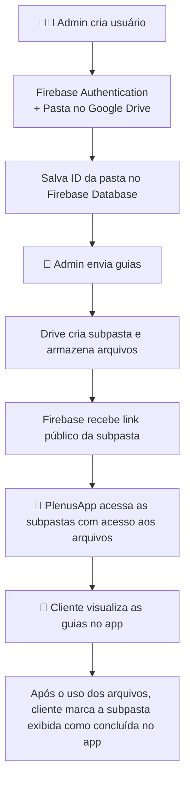

# PlenusDesk

**PlenusDesk** é uma aplicação web administrativa desenvolvida em **Flask**, utilizada por **empresas de contabilidade** para gerenciar clientes, guias de pagamento e documentos fiscais de forma centralizada.

Os clientes não acessam diretamente o painel Flask — eles interagem com os dados por meio do **[PlenusApp](#-conexão-com-o-plenusapp)**, um aplicativo Android desenvolvido em **Flutter**, que consome e exibe as informações sincronizadas automaticamente pelo PlenusDesk.

---

## ☁️ Integração com Firebase e Google Drive

O sistema integra **Firebase** e **Google Drive** para sincronização automática de dados e arquivos entre o painel administrativo (PlenusDesk) e o aplicativo mobile (PlenusApp).

### 🔹 Criação de Usuário

1. O administrador cria um novo cliente no **PlenusDesk**;  
2. O sistema registra o usuário no **Firebase Authentication** com as credenciais informadas;
3. É criada uma **pasta no Google Drive**, nomeada com o nome da empresa do cliente;
4. A **ID dessa pasta** é salva no **Firebase Realtime Database**, dentro do nó `usuarios/<user_id>`;  
5. O **PlenusApp** utiliza essa ID para acessar e exibir os arquivos correspondentes ao cliente.

### 🔹 Postagem de Guias

1. O administrador seleciona e envia os **documentos fiscais (PDF, XML, ZIP, etc)**;  
2. O sistema cria automaticamente uma **subpasta** dentro da pasta do cliente selecionado no Google Drive;  
3. Os arquivos são enviados para essa pasta e o **link** é armazenado no Firebase;  
4. O cliente visualiza as guias no aplicativo, com título, descrição ou instruções referente aos documentos, data e link direto para acessar a subpasta com os arquivos.

---

## ⚙️ Funcionalidades Complementares

Além da integração em nuvem, o PlenusDesk conta com automações que agilizam o controle fiscal e financeiro.

### 🧾 Validação de Cupons Fiscais
- Lê números de **cupons fiscais (NFC-e)** e valida o formato;  
- Detecta duplicidades e quebras de sequência;

### 📅 Processamento de Notas Fiscais
- Lê a **data de vencimento**, **parcelas** e **valor da nota** de cada **nota fiscal**;  
- Filtra as notas por **dia, mês, ano ou um período customizado**;
- **Soma automaticamente** os valores das notas do período selecionado, otimizando o cálculo contábil mensal.

Essas rotinas tornam o PlenusDesk uma ferramenta de **gestão inteligente de documentos fiscais**, indo além do simples envio de arquivos.

---

## 🔄 Fluxo de Dados

## 🧠 Arquitetura Técnica

A plataforma foi construída com um conjunto de tecnologias modernas e integradas, focando em escalabilidade e sincronização em tempo real.

| Camada | Tecnologia |
| :--- | :--- |
| **Frontend** | HTML, CSS e JavaScript |
| **Backend** | Flask (Python) |
| **Banco de Dados** | Firebase Realtime Database |
| **Autenticação** | Firebase Authentication |
| **Armazenamento de Arquivos** | Google Drive API |
| **Aplicativo Mobile** | Flutter (PlenusApp) |

## 🎥 Demonstrações

Os vídeos de demonstração a seguir mostram o sistema em uso real e destacam as funcionalidades principais:

* **👤 Cadastro de usuários** e sincronização automática com o Firebase;
* **📂 Envio de guias** e criação automática de pastas no Google Drive;
* **🔁 Exibição em tempo real** dos dados no PlenusApp;
* **🧾 Funções automáticas** de conferência de cupons e cálculo mensal de notas fiscais.

(Os vídeos estarão disponíveis em breve)

## 📱 Conexão com o PlenusApp

O **PlenusApp** é o aplicativo Android desenvolvido em Flutter que permite aos clientes visualizar as guias, documentos e arquivos enviados via PlenusDesk.

Ambos os sistemas (PlenusDesk e PlenusApp) utilizam o **mesmo Firebase Realtime Database**, garantindo **sincronização imediata e segura** de todos os dados entre o painel administrativo e o aplicativo do cliente.

📦 Repositório do PlenusApp: (link em breve)

## 🧑‍💻 Autor

**Nathan Fernandes Alves**  
Desenvolvedor FullStack • Foco em sistemas integrados e soluções automatizadas  

| Contato | Link |
| :-- | :-- |
| 📧 **E-mail Profissional** | [nathan.fernandes.dev@gmail.com](mailto:nathan.fernandes.dev@gmail.com) |
| 💼 **LinkedIn** | [linkedin.com/in/nathan-fernandes-alves](https://www.linkedin.com/in/nathan-fernandes-alves) |
| 🌐 **GitHub** | [github.com/nathan-fernandes-alves](https://github.com/nathan-fernandes-alves) |
